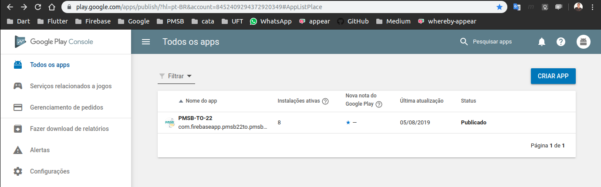
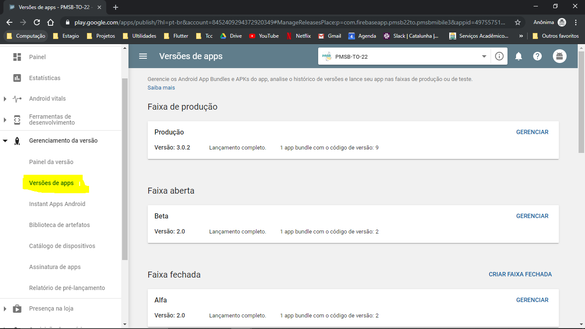
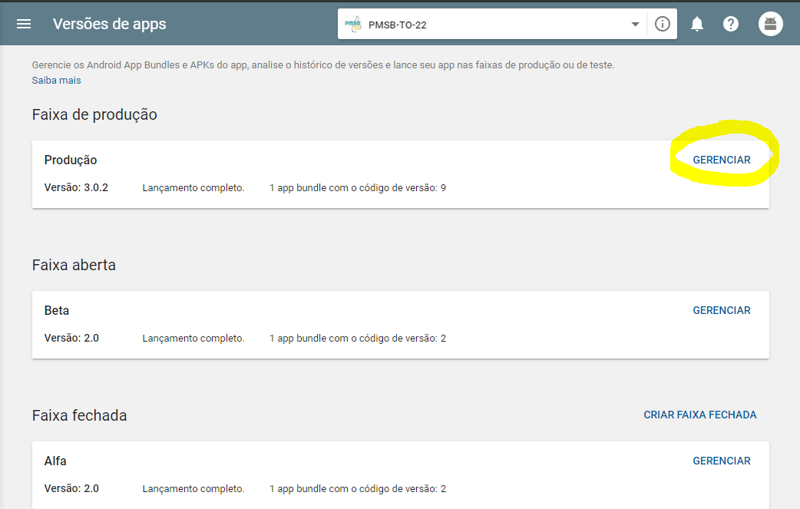
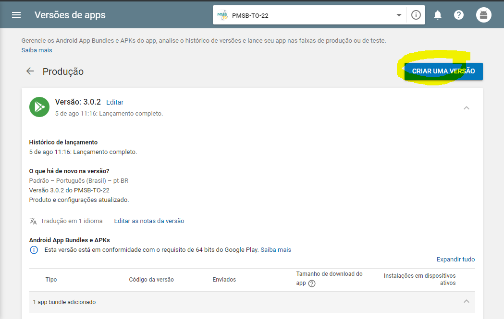

# Gerar versão de release e salvar na loja google play

## Gerar a versão de release

### Passo 1 

Abra o arquivo: android/app/build.gradle

Para configurar a verão do app. No defaultConfig atualizar as variáveis **versionCode** e **versionName**. Quando subir um app para a loja com um versionCode não é possivel subir novamente com o mesmo numero, sempre que gerar um novo release acrescentar o valor do versionCode.

Exemplo: 
Valor antigo
~~~
android {
        defaultConfig {
            versionCode 1
            versionName '1.0.0'
        }
}
~~~
Novo valor após atualizações para subir nova release
~~~
android {
        defaultConfig {
            versionCode 2
            versionName '1.0.1'
        }
}
~~~

### Passo 2
Na parte de release comenta a linha de modo de debug ( signingConfig signingConfigs.debug ) e descomentar a modo de release ( signingConfig signingConfigs.release ), deve ficar da seguinte forma.

Desenvolvimento:
~~~
android {
    buildTypes {
        release {
            //signingConfig signingConfigs.release
            signingConfig signingConfigs.debug

        }
    }
}
~~~

Gerar release.
~~~
android {
    buildTypes {
        release {
            signingConfig signingConfigs.release
            //signingConfig signingConfigs.debug

        }
    }
}
~~~
### Passo 2

Gerar app bundler com o seguinte comando, isso vai gerar um arquivo que vamos enviar ao google play ( Observação : O flutter tem que está na versao 1.7.8 ou superior). Usando o terminal faça

~~~
catalunha@nbuft:~/AndroidStudioProjects/pmsbmobile3$ flutter build appbundle --release 
~~~

---

## Salvar na loja.

### Passo 1
Acesse o google play console
https://play.google.com/apps/publish/?hl=pt-BR&account=8452409294372920349#AppListPlace

### Passo 2

Sera exibido a lista de seu aplicativos, escolha o que quer enviar a nova versão

### Passo 3

Vá em gerenciamento da versão e depois em versões de app 

### Passo 4

Vá em faixa de produção clique em gereciar no card de produção

### Passo 5

Apos isso vá em criar nova versão

Vai abrir um formulario da nova versão do app

Envie a nova versao do app no botão PROCURAR ARQUIVOS, e selecione o arquivo de appBundler gerado na parte anterior

Vão ter opções de atualizar novidades e nome da versão, isso é opcional.

Apos isso clique em continuar ( Revisar e publicar ), ele vai pedir que revise para ver se tudo está ok.

Depois clique em publicar e pronto.

Vai levar algumas horas para o app ser disponibilizado na loja.

Conferir.