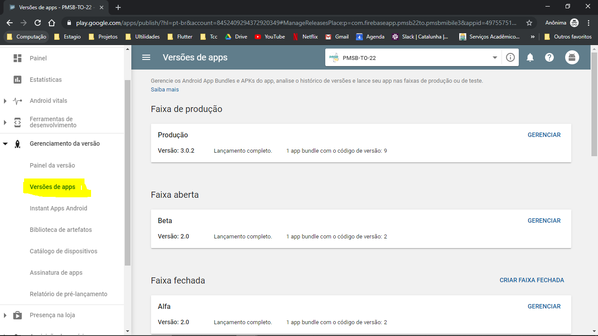
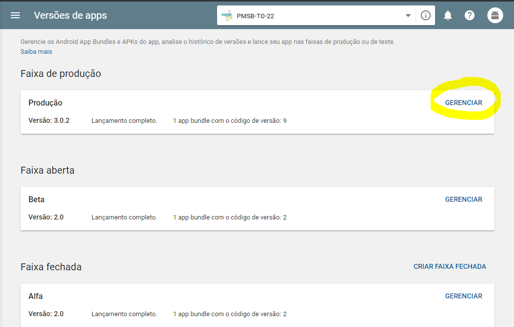
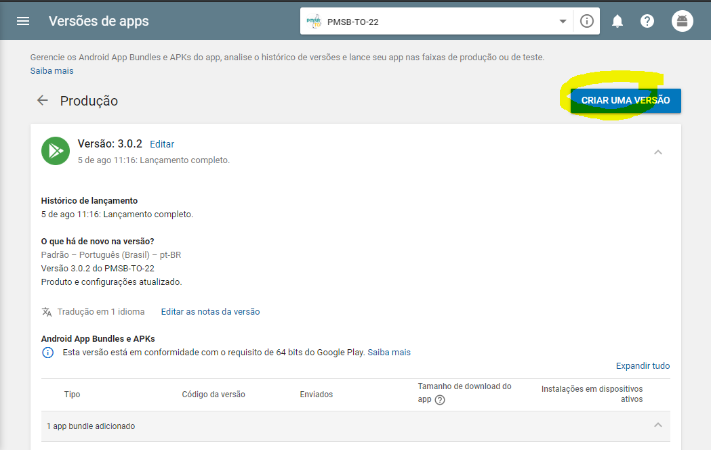

# Gerar versão de release e salvar na loja google play

---

## Gerar a versão de release

1 - no arquivo android/app/build.gradle configurar a verão do app

- No defaultConfig atualizar o version code e o version name. ( Quando subir um app pra loja com um versionCode não é possivel subir novamente, sempre que gerar um novo release subir o valor do versionCode )

        defaultConfig {
            // TODO: Specify your own unique Application ID (https://developer.android.com/studio/build/application-id.html).
            applicationId "com.firebaseapp.pmsb22to.pmsbmibile3"
            minSdkVersion 19
            targetSdkVersion 28
            multiDexEnabled true
            versionCode < Inserir aqui o version code >
            versionName '3.0.2'
            testInstrumentationRunner "androidx.test.runner.AndroidJUnitRunner"
        }

- Na parte de release comenta a linha de modo de debug ( signingConfig signingConfigs.debug ) e descomentar a modo de release ( signingConfig signingConfigs.release ), deve ficar da seguinte forma.

        buildTypes {
        release {
            signingConfig signingConfigs.release
            //signingConfig signingConfigs.debug

        }
    }

- Gerar app bundler com o seguinte comando, isso vai gerar um arquivo que vamos enviar ao google play ( Observação : O flutter tem que está na versao 1.7.8 ou superior)

        flutter build appbundle --release 

---

## Salvar na loja.

- Acesse o google play console

- Sera exibido a lista de seu aplicativos, escolha o que quer enviar a nova versão

- Vá em gerenciamento da versão e depois em versões de app 

- Vá em faixa de produção clique em gereciar no card de produção

- Apos isso vá em criar nova versão

- Vai abrir um formulario da nova versão do app

- Envie a nova versao do app no botão PROCURAR ARQUIVOS, e selecione o arquivo de appBundler gerado na parte anterior

- Vão ter opções de atualizar novidades e nome da versão, isso é opcional.

- Apos isso clique em continuar ( Revisar e publicar ), ele vai pedir que revise para ver se tudo está ok.

- Depois clique em publicar e pronto.

- Vai levar algumas horas para o app ser disponibilizado na loja.

